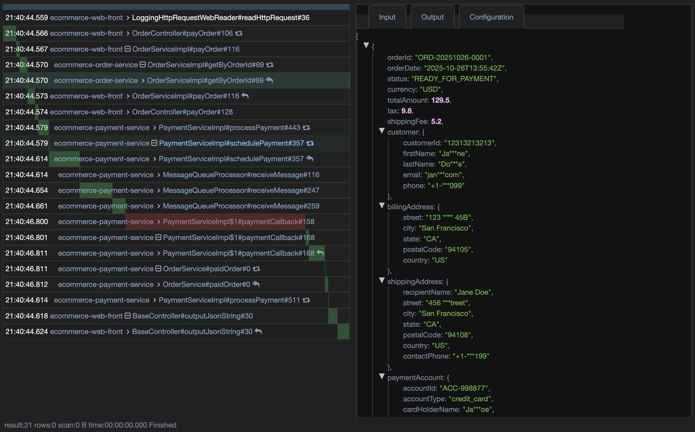

Why bitryon logger?

bitryon logger is a tracer and a logger both. Developers only need to annotate methods and classes to log the parameters and return as trace without writing any logs manually.

bitryon logger is the next generation logger and tracing solution, seamlessly unify logs across services as workflow, sanitize sensitive/personal identification information/PII content painlessly, and test supports against models and services.

1: logging could be much ambiguous leading the troubleshoot very exhausted. with bitryon logger, just configuration can cover all of necessary logs. bitryon logger also support writing logs to the tracing by your own. -- with proper configuration even no need to write a single log.

2: When you access complicated business logic cross services, tracing the payloads would be much challenging. bitryon logger provides logging in language support(No need http proxy/servers) to capture the entire logic traces - no need to search logs any more although we provide.

3: when you sanitize sensitive/PII in the logs, the difficulty is you may do it before writing into logs, or other assistances. Simple bitryon logger configurations can convert to the desired mask or encryption without changing code.

4: with well preserved logs, in batch basis painlessly testing or re-entering the methods that were failed due to bugs or errors turns troubleshooting and datafix an easy job.

5: bitryon logger can co-exist with any logger like log4j.

More details please check out [www.bitryon.io](https://www.bitryon.io) and [bitryon-logging-java-spring-example](https://github.com/FrankNPC/bitryon-logging-tracing-examples/tree/master/bitryon-logging-java-spring-example) 

more language supports coming soon

